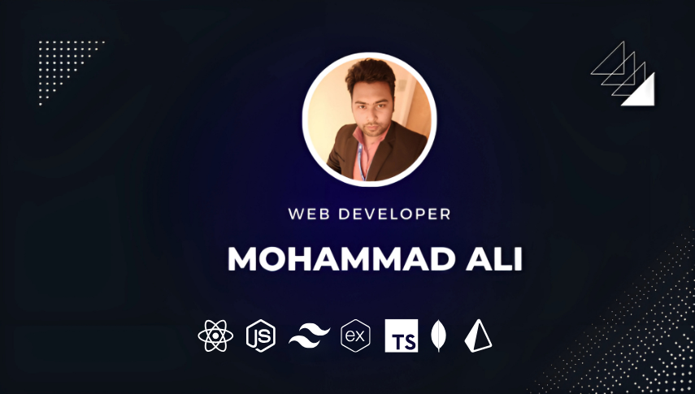

# 📊 Current Stats:

  

  

# 🌐 Connect with me:

    
    
    

# 🛠 Language and tools:

> Tools, languages, and other things that I like to work with.

<table>
  <tr>
    <td align="center" width="96">
      
       React
    </td>
    <td align="center" width="96">
      
       JavaScript
    </td>
    <td align="center" width="96">
      
       TypeScript
    </td>
    <td align="center" width="96">
      
       Node.js
    </td>
    <td align="center" width="96">
      
       Express
    </td>
    <td align="center" width="96">
      
       Tailwind
    </td>
    <td align="center" width="96">
      
       Bootstrap
    </td>
  </tr>
  <tr>
    <td align="center" width="96">
      
       MongoDB
    </td>
    <td align="center" width="96">
      
       Mongoose
    </td>
    <td align="center" width="96">
      
       Redux
    </td>
    <td align="center" width="96">
      
       Next.js
    </td>
    <td align="center" width="96">
      
       SQL
    </td>
    <td align="center" width="96">
      
       PostgreSQL
    </td>
    <td align="center" width="96">
      
       Prisma
    </td>
  </tr>
</table>

# 👤 About Me:

-   👋 Full-stack developer passionate about building scalable and user-centric web applications.
-   💻 Proficient in React.js, Node.js, and modern JavaScript/TypeScript.
-   🌐 Skilled in creating dynamic and interactive user interfaces as well as robust backend systems.
-   🚀 Eager to explore emerging technologies and frameworks across the tech stack.
-   📚 Continuously learning and growing with a focus on industry best practices.

---

### What I'm Excited About

-   🚀 Exploring cutting-edge technologies and frameworks for full-stack development.
-   🌐 Contributing to open-source projects to support and grow the developer community.
-   📚 Embracing continuous learning to stay ahead in the tech industry.